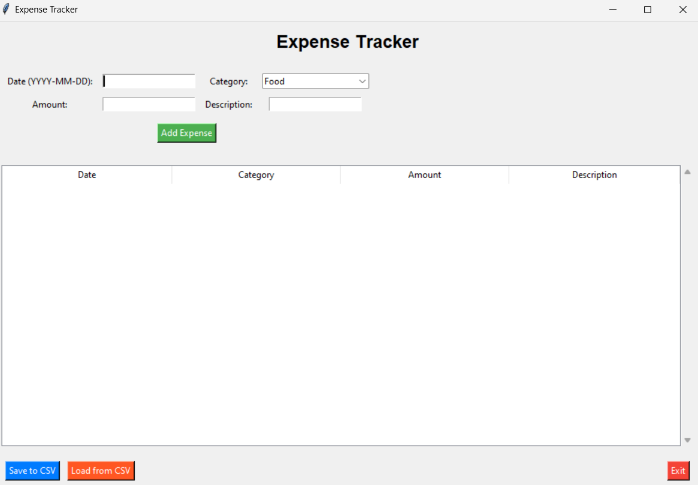

# Expense Tracker

## Overview
The **Expense Tracker** is a Python application that allows users to track their expenses by adding, viewing, and managing entries in a structured format. It supports saving and loading expense data to/from CSV files, making it easy to maintain records.

## Features
- **Add Expense**: Add expense details including date, category, amount, and description.
- **View Expenses**: Display expenses in a tabular format using a tree view.
- **Save to CSV**: Save the current list of expenses to a CSV file.
- **Load from CSV**: Load expenses from an existing CSV file.
- **Responsive Design**: Easy-to-use graphical interface with scrollable tables.

## Prerequisites
1. **Python 3.x**: Ensure Python is installed on your system.
2. **Required Libraries**:
   - `tkinter`: Pre-installed with Python (used for GUI).
   - `pandas`: For managing and manipulating data.
   - Install pandas if not already installed:
     ```bash
     pip install pandas
     ```

## How to Use
### Running the Application
1. Save the script as `expense_tracker.py`.
2. Open a terminal or command prompt and navigate to the file's directory.
3. Run the script:
   ```bash
   python expense_tracker.py
   ```

### Adding Expenses
1. Enter the **date** in `YYYY-MM-DD` format.
2. Select a **category** from the dropdown menu (e.g., Food, Transport).
3. Enter the **amount** (must be a numeric value).
4. Optionally, add a **description**.
5. Click the **Add Expense** button to save the entry.

### Saving and Loading
- **Save to CSV**: Click the **Save to CSV** button and specify the filename to save your expenses.
- **Load from CSV**: Click the **Load from CSV** button to import data from an existing CSV file.

### Exiting
- Click the **Exit** button to close the application.

## File Structure
```
expense_tracker.py   # Main application script
README.md            # Documentation file (this file)
```

## Example Screenshot


## Customization
- **Categories**: Modify the `categories` list to include your preferred expense categories.
- **Color Scheme**: Update the button background and text colors in the script for a personalized look.
- **Columns**: Add more columns or adjust their order by modifying the `columns` list.

## Error Handling
- **Input Validation**:
  - Ensures required fields (date, category, amount) are filled.
  - Validates that the amount is numeric.
- **File Handling**:
  - Prompts the user when saving or loading files.
  - Handles errors during file operations.

## Future Enhancements
- Add **charts and graphs** for visualizing expense trends.
- Implement **expense filtering** by date or category.
- Provide options to **edit or delete specific entries**.


## Acknowledgments
- Built using **Python**, **Tkinter**, and **Pandas**.
- Inspired by the need for simple, efficient expense management.
